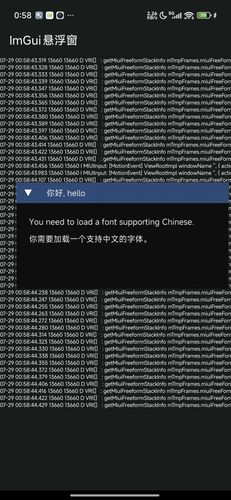
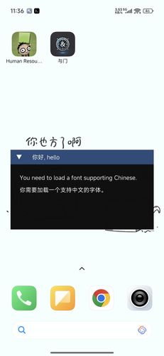

# Android Floating Window ImGui

## 项目简介

- 在 Android 设备上运行并显示 ImGui 窗口。
- **请勿用于非法用途，仅供学习交流，不良后果请自行承担。**

> ~~因设备开发效率低，暂停开发，~~*欢迎协助，幸甚*
> 有新方案了，继续开发，欢迎加入开发

## 获取和安装

请遵守[MIT许可证](https://mit-license.org/)的具体要求。
**需要熟悉`AIDE`的使用，根据AIDE的配置文件修改到你的编辑器能够正确识别为止**。

1. 克隆本项目，并使用 `AIDE` 或其他兼容软件打开。
2. 原地解压仓库根目录下的两个压缩包
2. 编译并安装到 Android 设备，授予悬浮窗权限后即可使用。
4. 修改仓库根目录下的 code/main.cpp，实现自己的程序逻辑。

## 设计思路

1. 使用service启动，保持后台长期运行
2. 打开一个占一定屏幕面积的悬浮窗，接受事件，显示内容，使用`c++`编写逻辑，处理图形和输入
4. 完善**触屏输入法**功能支持
> 这个方案只打开了一个悬浮窗，并非全屏，悬浮窗可自由移动，而内容被限制在窗口内部。同一个程序暂不支持打开多个悬浮窗，需要imgui多窗口可以增加悬浮窗大小，但悬浮窗透明部分触摸无法穿透。在[ImguiAndroid](https://gitee.com/alexmmc/ImguiAndroid)里有穿透触摸的方案（通过adb）。

## 鸣谢

1. [ImguiAndroid](https://gitee.com/alexmmc/ImguiAndroid)，第一版参考了这个项目的思路，许可证副本见[license-other](https://gitee.com/alexmmc/ImguiAndroid/blob/master/LICENSE)。

## 可改进的部分

- 使用**前台服务**
- 添加接口：设置移动、缩放区域大小、可选是否显示占用区（两个）
- 缩小拖动区域（横方向缩小）

## 未解决的问题

- 更多输入事件（目前只有手指触摸）
- 完善`Service`的生命周期、添加退出功能
- 录屏截屏时imgui窗口非半透明

## 扩展问题
- 不同线程执行`EGL`，上下文不同？（在AppInit和AppIterate功能里，现已把AppInit的代码放在同一个线程
- 如何传递输入事件(用`jni`连接*Java*和*cpp*时)？

## 其他方案

旧方案：
> 1. 使用service启动，保持后台长期运行
> 2. 创建全屏的`SurfaceView`，不可聚焦、不可触摸、不处理事件，显示内容，使用`c++`编写逻辑，处理图形和输入
> 3. 创建多个透明的普通`View`接受输入，可触摸、可聚焦，每个view的位置跟随对应的imgui窗口，建议在触摸或鼠标事件结束后更新位置

- 其他方案：获取`NativeActivity`源代码，修改使它的`SurfaceView`放置在悬浮窗中

## 效果展示

